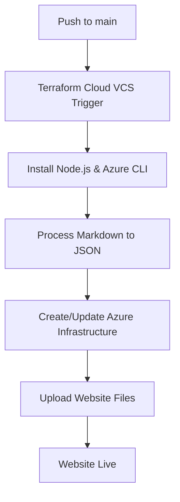

# Terraform Cloud Configuration Guide (Private Repository)

This guide explains how to configure Terraform Cloud to work with your personal website project in a private repository.

## Overview

Your project uses Terraform Cloud for complete deployment pipeline:

- **Terraform Cloud**: Manages infrastructure state, content processing, and deployment
- **Private GitHub Repository**: Source code with sensitive information
- **Azure Storage**: Hosts the static website

**Note**: This setup works with private repositories since Terraform Cloud runners handle all processing.

## Terraform Cloud Configuration Steps

### 1. Workspace Configuration

In your Terraform Cloud console (`app.terraform.io`):

1. Navigate to your workspace: `CUM/personal-website`
2. Go to **Settings** → **Version Control**
3. Connect to your GitHub repository
4. Set **VCS branch** to `main`
5. Configure **Automatic run triggering** for:
   - `terraform/**`
   - `source/**`

### 2. Environment Variables

Set these environment variables in your workspace:

**Azure Authentication:**
- `ARM_CLIENT_ID` - Azure Service Principal Client ID
- `ARM_CLIENT_SECRET` - Azure Service Principal Secret (sensitive)
- `ARM_SUBSCRIPTION_ID` - Azure Subscription ID  
- `ARM_TENANT_ID` - Azure Tenant ID

**Terraform Variables:**
- `subscription_id` - Your Azure subscription ID
- `location` - Azure region (default: "East US")
- `tags` - Resource tags (optional)

### 3. Workspace Settings

**Execution Mode:** Remote (default)
**Terraform Version:** 1.5.0 or later
**Auto Apply:** Enable for automatic deployments

### 4. Triggers and Workflow

The workspace will automatically trigger when:
- Changes are pushed to `terraform/` directory
- Changes are pushed to `source/` directory (website files)
- Changes are pushed to `content/` directory (blog posts)
- Manual runs are triggered

## Complete Deployment Process

Terraform Cloud handles the entire pipeline using `null_resource` provisioners:

1. **Infrastructure**: Creates Azure Storage Account and enables static website hosting
2. **Content Processing**: Installs Node.js, processes markdown files to JSON
3. **File Upload**: Uploads all files from `source/` directory using Azure CLI
4. **Website**: Immediately available at the generated URL

## No GitHub Actions Required

Since this is a private repository, no GitHub Actions workflows are needed. Terraform Cloud:
- Has access to private repositories via VCS integration
- Runs on Terraform Cloud's secure infrastructure
- Processes sensitive information safely

## Deployment Flow

## Troubleshooting

### Common Issues

1. **Authentication Errors**
   - Verify Azure credentials in Terraform Cloud environment variables
   - Ensure Service Principal has Storage Account permissions

2. **File Upload Failures**  
   - Check Azure CLI installation in Terraform Cloud runners
   - Verify storage account access keys

3. **GitHub Integration Issues**
   - Ensure webhook is configured correctly
   - Check VCS connection in workspace settings

### Verification

After deployment, verify:
- Terraform Cloud run completed successfully
- Website URL accessible (check outputs)
- All files uploaded to `$web` container in storage account

## Manual Operations

### Force Re-upload
To force a re-upload of all files, you can:
1. Manually trigger a Terraform run in the workspace
2. Or update the `source_hash` trigger in the `null_resource`

### State Management
State is managed by Terraform Cloud automatically. No local state files are needed.